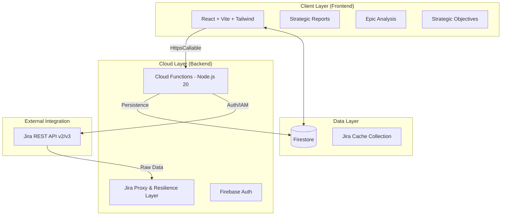

# ION Dashboard - Sistemas de Inteligência Estratégica

[](https://www.ionsistemas.com.br/)

O **ION Dashboard** é uma plataforma de alta performance desenvolvida para a **ION Sistemas**, consolidando dados do Jira Cloud em insights estratégicos em tempo real através do Firebase.

## 🏗️ Arquitetura do Sistema

A arquitetura utiliza uma abordagem "Cache-First with Background Sync", garantindo que executivos tenham acesso instantâneo aos dados enquanto o sistema sincroniza com o Jira de forma assíncrona.

### Visão Geral da Arquitetura


---

## 🚀 Tecnologias e Ferramentas

### Frontend
- **Framework**: React 18+ com Vite.
- **Estilização**: Tailwind CSS + Vanilla CSS (Efeitos Glassmorphism e 3D).
- **Componentes**: Radix UI + Lucide Icons + Framer Motion.
- **Gráficos**: Recharts + Custom 3D Tubular Indicators.
- **Identidade**: Tipografia **Poppins** e paleta `#FF4200` (Orange) / `#001540` (Navy).

### Backend (Firebase)
- **Functions v2**: Node.js 20 com gerenciamento de concorrência e memória otimizada.
- **Firestore**: Banco de dados real-time para cache de epics e gestão de OKRs.
- **Auth**: Controle de acesso baseado em regras (RBAC).

---

## 💎 Identidade Visual (ION Brand)

O sistema segue rigorosamente a identidade visual da **ION Sistemas**:

- **Cores**: 
  - **Primária**: `#FF4200` (Laranja ION)
  - **Secundária**: `#001540` (Azul Marinho ION)
  - **Apoio**: Tons de Slate para interfaces Dark Mode.
- **Design Elements**: Border-radius "Pill" (2rem+), sombras profundas, e transparências saturadas.

---

## ⚡ Recursos Principais

- **Weighted Progress Logic**: Cálculo de progresso baseado em **Story Points** (`customfield_10016`), priorizando valor entregue sobre quantidade de tarefas.
- **Strategic Reports**: Gerador de relatórios executivos em formato A4 ("APURAÇÃO ESTRATÉGICA").
- **Health Scoring**: Algoritmo que cruza variância de datas e progresso para prever riscos de entrega.

---

## 🛠️ Comandos Úteis

### Instalação
```bash
npm install
```

### Desenvolvimento Local
```bash
npm run dev
```

### Build de Produção
```bash
npm run build
```

### Deploy Firebase
```bash
npx firebase deploy
```

---
© 2025 **ION Sistemas**. Todos os direitos reservados.
